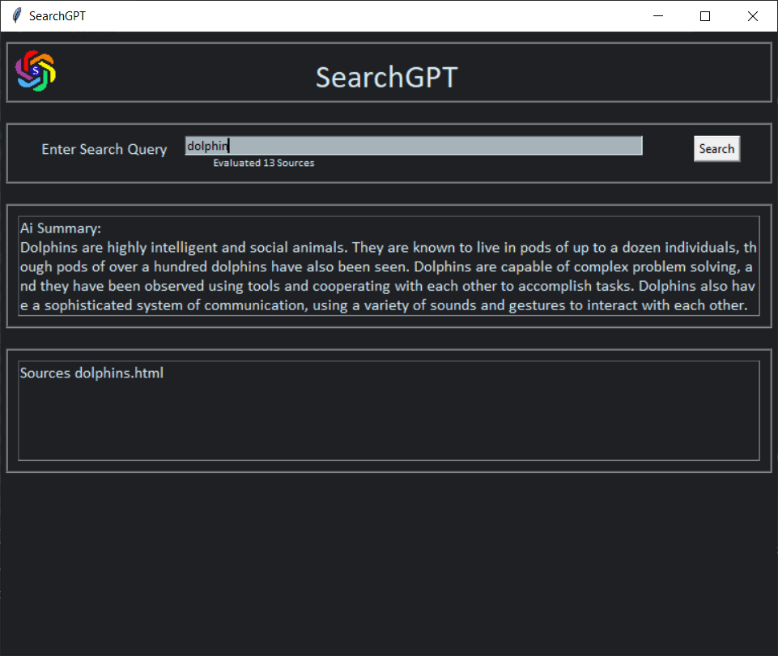

# SearchGPT

## Inspiration
With the unstoppable rise of AI, it is only a matter of time before another, more elegant search option will emerge. We want to be ahead of the curve with a focus on convenience and accuracy, what people expect from a search engine.
## What it does
SearchGPT works by indexing web content based on keywords and backlinks. When a user makes a query, web content is assigned a relevance score based on its similarity to keywords and the number of relevant backlinks. AI then reads the content of the top results and summarizes it for the user.
## How we built it
We used C++ to create a web crawler that was capable of parsing data from HTML files. The HTML webpages were manually made by us as a proof of concept and were not downloaded from any webpages. This was because it would have taken a long time to parse the large, complicated HTML files of today's internet. We also wanted more fine-tuned control over the data the search engine was fed, because it is not perfectly adapted to every type of content. Once we had a web crawler, we made keyword datasets based on the words found in the HMTL files. The 2 keyword datasets we needed were IDK (inverse document frequency) and TF (term frequency). TF is a list of unique words per file, and a number representing the occurrences of a given word/number. IDK is a list of the unique words in every webpage, with each word mapping to a number. That number is the number of documents that contain that word divided by the total number of documents. The final thing we needed was page rank. This was based on the algorithm by Larry Page. It is able to recursively count backlinks and use the backlinks to score the HTML files. After page ranking worked, we were able to implement search using the datasets. 
## Challenges we ran into
One challenge we ran into was getting page rankings to work. We started by using ChatGPT and Bard to generate the code for the algorithm, and even though we put a lot of work into debugging, we weren't able to get it to work. After 7 hours and many full rewrites of the algorithm, we were able to understand the algorithm and implement it for our case. This was a massive challenge, and we almost quit over it, but we were able to get it to work in the end. 
## Accomplishments that we're proud of
Our largest accomplishment is solving the page ranking algorithm. Because it almost made us quit, and it took a lot of our time, it felt super good when we solved it. Another big accomplishment was being able to integrate the 3 systems we worked on at the end to make the finished product. 
## What we learned
We learned that we should understand a GUI library before proceeding with a project. We wanted our GUI to look better than how it turned out this time, and I think that that would have made it a lot more pleasant to use. 
## What's next for SearchGPT
We have a few ideas for things we could implement next for SearchGPT. One of them was a better way to group words with similar meanings, such as "run" and "running", "goose" and "geese", and "dolphins" and "dolphin". This would make it much more versatile as searches could be much less generic. Another idea we had was to connect it to text-to-speech, so it would be easy for people with disabilities to use SearchGPT. 
